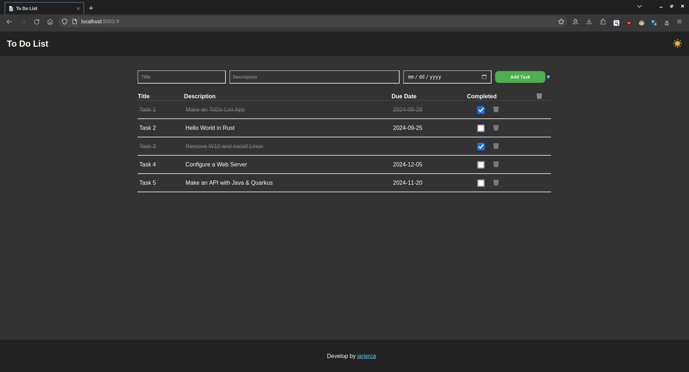
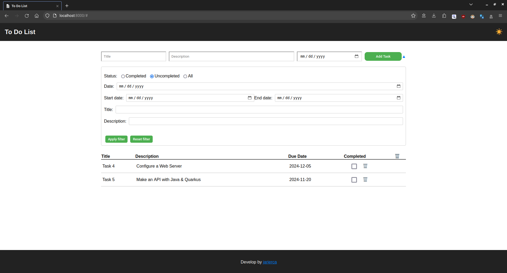

# Project To-Do List

The To-Do List project is a web application designed to help users manage their daily tasks effectively. The application offers an intuitive and straightforward interface that allows users to create, edit, mark as completed, and delete tasks quickly and efficiently.

## Key Features

- **Task Management**: Allows users to add new tasks with a title, description, and optional due date.
- **Clear Visualization**: Presents the list of tasks in an organized and readable format to facilitate identification of pending tasks.
- **Mark as Completed**: Users can mark tasks as completed with a simple click.
- **Delete Tasks**: Provides the option to delete tasks that are no longer needed.
- **Task Filtering**: Allows filtering tasks by completion status, due date, title, and description.
- **Data Persistence**: Stores tasks locally in the browser to ensure availability even after closing the browser window.

## Technologies Used

The To-Do List project has been developed using the following technologies:

- **HTML5**: For the structure and content of the web page.
- **CSS3**: For the design and styling of the user interface.
- **JavaScript (ES6+)**: For the application logic and page interactivity.
- **localStorage**: For local storage of user tasks.
- **Git**: For version control of the source code.
- **GitHub**: For hosting the project repository and facilitating collaboration with other developers.

## Usage Instructions

1. Clone the project repository to your local machine.
2. Open the `index.html` file in your web browser.
3. Use the application to manage your daily tasks as needed.
4. Enjoy efficient task management!

## Contribution

If you wish to contribute to the To-Do List project, follow these steps:

1. Fork the repository on GitHub.
2. Clone your fork to your local machine.
3. Create a new branch for your contribution: `git checkout -b new-feature`.
4. Make the necessary changes and commit them with descriptive messages.
5. Push the changes to your GitHub repository: `git push origin new-feature`.
6. Create a pull request in the original repository for your changes to be reviewed.

## License

This project is licensed under the GNU General Public License v3.0 (GPL-3.0). See the [LICENSE](LICENSE) file for more details.

---

The To-Do List project simplifies the management of your daily tasks. If you have any questions or suggestions, feel free to contact us. Thank you for using our application!
